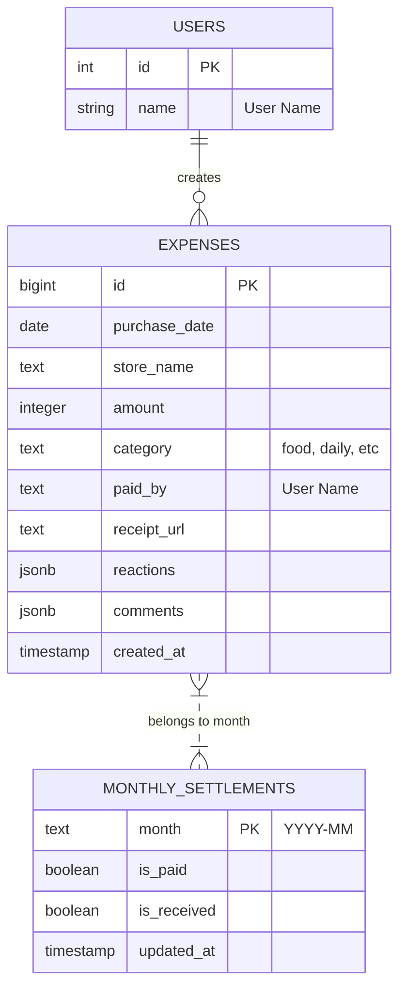

# Kurasel 🏡

**暮らしと精算 (Living & Settlement)**

**Kurasel** は、ふたりの暮らしとお金を整える、シンプルでモダンな精算アプリです。
レシートを撮るだけでAIが自動入力。面倒な計算はアプリに任せて、支払いや受け取りのステータスもひと目で管理。「お金のやり取り」を事務作業から「心地よいコミュニケーション」へ変えます。


## ✨ 特徴 (Features)

* **🤖 AIレシートスキャン**
    * Google Gemini 1.5 Flash を活用。カメラでレシートを撮るだけで「店名・金額・日付・カテゴリ」をAIが即座に自動入力します。
* **✅ 精算ステータス管理**
    * 月ごとに「支払い完了」「受け取り完了」のステータスを管理。誤操作防止の確認機能付きで、払い忘れや二重払いを防ぎます。
* **✨ スマート精算**
    * 通常の割り勘に加え、「スキャン手当（入力してくれた人への感謝代）」や「端数調整（100円単位）」を自動計算するスマートモードを搭載。
* **☁️ レシートクラウド保存**
    * スキャンしたレシート画像はクラウド（Supabase Storage）に自動保存。いつでも見返せます。
* **💬 豊かなコミュニケーション**
    * 履歴ごとにコメントやアニメーション付きリアクション（❤️, 👍, 🎉, 🙏）を送れ、会話が生まれます。
* **📱 PWA対応**
    * ホーム画面に追加することで、ネイティブアプリのような滑らかな操作感を実現。
* **🎨 洗練されたUI**
    * スレートグレーとホワイトを基調とした、清潔感のあるグラスモーフィズムデザイン。

## 🛠️ 技術スタック (Tech Stack)

* **Framework:** Next.js 14 (App Router)
* **Language:** TypeScript
* **Styling:** Tailwind CSS
* **Database & Storage:** Supabase (PostgreSQL)
* **AI:** Google Generative AI SDK (Gemini 1.5 Flash)
* **Icons:** Lucide React
* **Deployment:** Netlify / Vercel

## 🚀 ローカルでの実行方法 (Setup)

1.  **リポジトリのクローン**
    ```bash
    git clone [https://github.com/KouSei089/kurasel.git](https://github.com/KouSei089/kurasel.git)
    cd kurasel
    ```

2.  **依存関係のインストール**
    ```bash
    npm install
    ```

3.  **環境変数の設定**
    `.env.local` ファイルを作成し、以下のキーを設定してください。
    ```env
    NEXT_PUBLIC_SUPABASE_URL=your_supabase_url
    NEXT_PUBLIC_SUPABASE_ANON_KEY=your_supabase_anon_key
    GOOGLE_API_KEY=your_gemini_api_key
    ```
    Geminiのキーに `NEXT_PUBLIC_` は付けないでください。付けるとブラウザのJSに埋め込まれて誰でも読めます。AI処理は `app/api` 配下のルートでサーバー側だけが行います。

4.  **開発サーバーの起動**
    ```bash
    npm run dev
    ```
    http://localhost:3000 にアクセスして確認できます。

## 📂 データベース設定 (Supabase SQL)

`supabase/schema.sql` の中身をSupabaseのSQL Editorに貼り付けて実行してください。
`users` / `expenses` / `monthly_settlements` の3テーブルと、レシート画像用の `receipts` バケット、
およびアクセスポリシーがまとめて作成されます。何度実行しても問題ありません。

## ⏰ プロジェクトの一時停止対策

Supabaseの無料プランは、データベースへのアクセスが1週間ないとプロジェクトを一時停止し、
そのまま放置すると削除します。`.github/workflows/keepalive.yml` が1日1回だけ軽いクエリを投げて、
これを防ぎます。GitHubのリポジトリ設定で以下のSecretsを登録してください。

| Secret 名 | 値 |
|---|---|
| `SUPABASE_URL` | `NEXT_PUBLIC_SUPABASE_URL` と同じ |
| `SUPABASE_ANON_KEY` | `NEXT_PUBLIC_SUPABASE_ANON_KEY` と同じ |

## 🏗️ システム構成図 (Architecture)

```mermaid
graph TD
    User((User))
    subgraph "Frontend (PWA)"
        UI[Next.js App Router]
        Logic[Business Logic]
    end

    subgraph "Server (Next.js API Route)"
        API[/api/analyze-receipt]
    end
    
    subgraph "AI Service"
        Gemini[Google Gemini 1.5 Flash]
    end
    
    subgraph "Backend (Supabase)"
        DB[(PostgreSQL)]
        Storage[Storage Bucket]
    end

    User -->|📸 Take Photo| UI
    UI -->|🖼️ Image Data| API
    API -->|🔑 API Key はサーバー側のみ| Gemini
    Gemini -->|📝 JSON Extraction| API
    API -->|📝 Result| Logic
    Logic -->|💾 Insert Data| DB
    Logic -->|☁️ Upload Image| Storage
    DB -->|📊 Fetch History| UI
```

### 2. ER図 (Entity Relationship Diagram)

データベースの設計図です。`expenses`（支出）と `monthly_settlements`（精算ステータス）の関係などを定義します。


